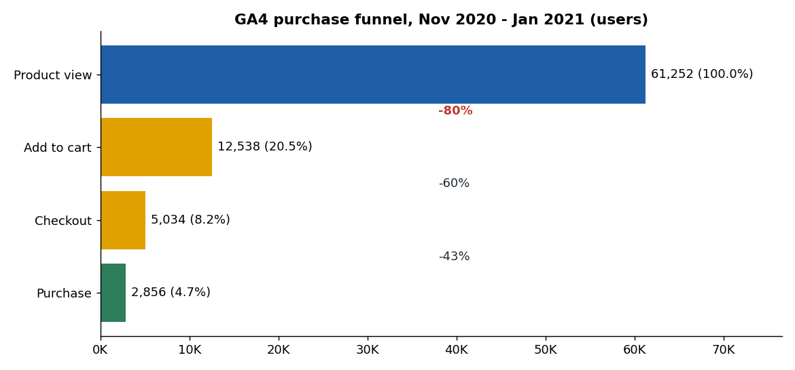
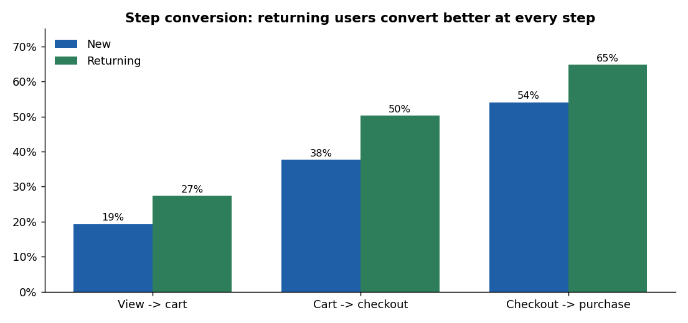
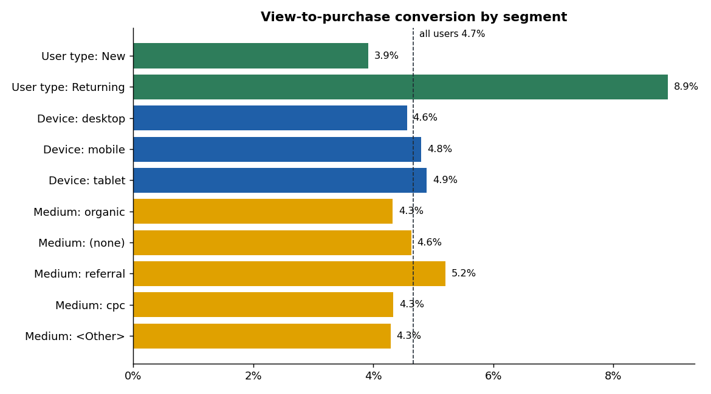

# Product Funnel Analysis (GA4 + BigQuery)

Where do shoppers drop out between viewing a product and buying it, and which users convert best?

This project queries Google's public **GA4 e-commerce sample** (Google Merchandise Store,
Nov 2020 - Jan 2021) in **BigQuery** to build a sequenced four-step purchase funnel
(product view, add to cart, checkout, purchase), then analyzes drop-off by device, traffic
source, month and new vs returning users in Python.

**Tools:** BigQuery SQL (CTEs, `UNNEST`, `ROW_NUMBER`, `APPROX_QUANTILES`), Python (pandas, SciPy, matplotlib)



## Results

61,252 users viewed a product; **2,856 bought (4.7%)**. All 5 consistency checks pass
(every step is smaller than the one before, and each segment adds up to the total).

| Step | Users | Step conversion | Drop-off |
|---|---|---|---|
| Product view | 61,252 | | |
| Add to cart | 12,538 | 20.5% | **79.5%** |
| Checkout | 5,034 | 40.1% | 59.9% |
| Purchase | 2,856 | 56.7% | 43.3% |

**1. The biggest leak is product page to cart.** 80% of viewers never add to cart, which is **83% of all
users lost** in the funnel. Checkout loses 43% of people who start it, but that is only 4% of total losses.

**2. Returning users convert 2.3x better.** Users whose first product view came in a later session bought
8.9% of the time vs 3.9% for first-session users (p < 0.001), and they convert better at every step:
27% vs 19% add to cart, 50% vs 38% start checkout, and 65% vs 54% complete it.



**3. Device barely matters.** Mobile converted 4.8% vs desktop 4.6% (p = 0.18, not significant). Step
rates are within 1 point of each other, so the product page problem is not a mobile-only problem.

**4. Referral traffic converts best.** Referral visitors converted at 5.2% vs 4.3% for organic search
(1.2x, p < 0.001). Paid search (cpc) converted at the same 4.3% as organic.



**5. December was the strongest month.** 30% of December's first-time viewers added to cart vs 12.5% in
November and 18% in January. November viewers who did buy took much longer (median 154 hours), which suggests
many browsed early and bought during the holiday period.

### Recommendations

1. **Fix the product page first.** It loses 4 of 5 viewers. Test clearer price and shipping info,
   stock status, reviews, and a more visible add-to-cart button, starting with the top viewed items.
2. **Bring visitors back.** Returning users convert 2.3x better, so remarketing to product viewers who didn't
   buy (email capture, retargeting, saved carts) is likely the highest-return lever.
3. **Lean into referral partners**, which convert 20% better than organic search.
4. **Then look at checkout:** 43% of people who start checkout leave, so check for surprise shipping
   costs or forced account creation.

### Caveats

* The GA4 sample is **obfuscated** by Google, and some fields show `<Other>` or `(data deleted)`, so treat
  segment numbers as directional.
* "Returning" means the user's first product view happened in session 2 or later (`ga_session_number`).
* The funnel is sequenced: a user counts at a step only if they did it after the previous step.

## How it works

`sql/funnel.sql` runs in BigQuery and returns one small table (15 rows) of users per step by segment:

1. Pull view_item, add_to_cart, begin_checkout and purchase events (Nov 2020 - Jan 2021), with the
   session number unnested from `event_params`.
2. Find each user's **first product view** with `ROW_NUMBER()`, and take device, traffic medium, month and
   new/returning from that event.
3. For each next step, keep the first time the user did it **after** the previous step.
4. Count users at each step per segment, plus the median hours from first view to purchase.

The result is saved in `data/ga4_funnel_results.csv`. Python (`funnel/`) checks it, computes step and overall
conversion, drop-off, and two-proportion z-tests between segments.

The query scans about 1 GB, well within the free BigQuery sandbox (1 TB of queries per month).

## Run it

```bash
# 1. (optional) re-run sql/funnel.sql in the BigQuery console and save the result as data/ga4_funnel_results.csv
pip install -r requirements.txt
python -m funnel               # checks, rates, drop-off, tests -> outputs/
python scripts/make_charts.py  # charts -> docs/
pytest                         # 8 tests
```

## Project structure

```
sql/funnel.sql             BigQuery funnel query
data/                      query result (15 rows)
funnel/                    analysis.py (checks, rates, drop-off, z-tests), __main__.py
outputs/                   funnel_rates.csv, dropoff_all_users.csv, tests.json, quality_checks.csv
scripts/make_charts.py     charts
docs/                      charts used in this README
tests/                     pytest suite
```

## Data source

Google Analytics 4 obfuscated sample e-commerce dataset,
`bigquery-public-data.ga4_obfuscated_sample_ecommerce` (Google Merchandise Store), public on BigQuery.

## License

MIT (code).
